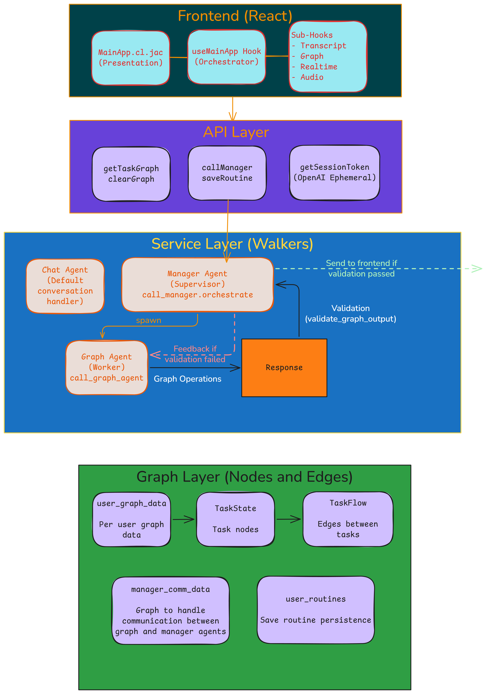
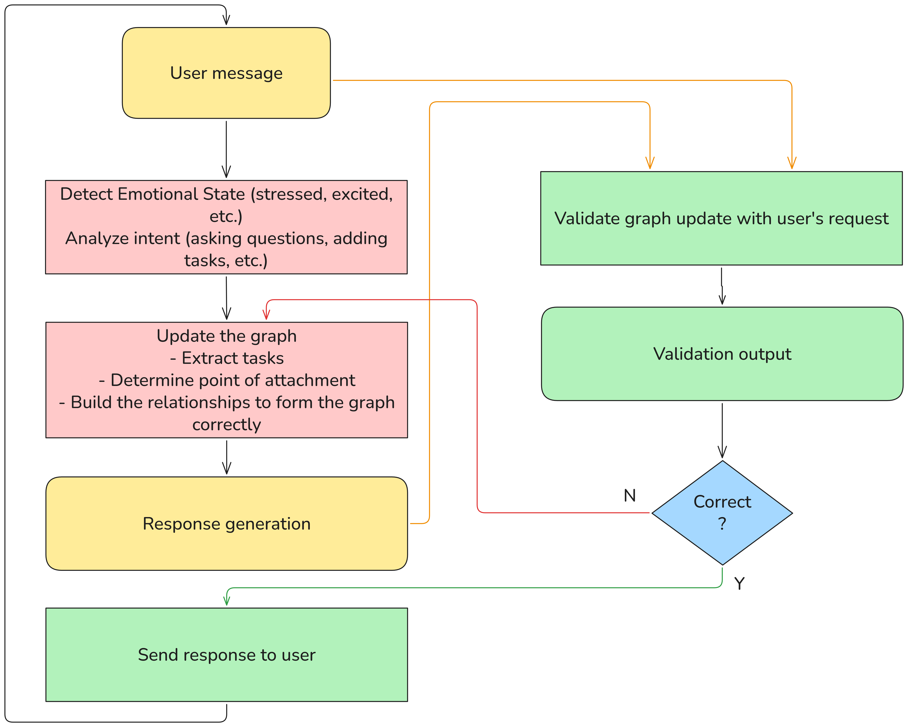

# Algo - Voice-Enabled Task Graph Assistant

Algo is a voice-enabled personal AI assistant that helps you visualize and manage your daily routines as an interactive task graph. Using the OpenAI Realtime API for voice interactions, Algo understands your intent and automatically builds, validates, and maintains a directed graph of your tasks and routines.

## Features

- 🎙️ **Voice Interface** - Natural conversations via OpenAI Realtime API
- 📊 **Task Graph Visualization** - Interactive directed graph showing your routines
- 📈 **Analytics & Insights** - Activity tracking, behavioral patterns, and AI-powered recommendations
- 🤖 **Multi-Agent Architecture** - Manager supervises Graph Agent with intelligent validation
- ✅ **Automatic Corrections** - Detects and fixes missing tasks, wrong names, and incorrect edge labels
- 🔄 **Graph Operations** - Rename tasks, insert between tasks, reorder routines
- 💾 **Routine Persistence** - Save and load your daily routines
- 🔐 **Authentication** - Secure login/register system

## Installation

1. **Clone the repository**
   ```bash
   git clone https://github.com/jaseci-labs/Algo.git
   cd Algo
   ```

2. **Set up your API key**

   Create a `.env` file or set environment variable:
   ```bash
   export OPENAI_API_KEY='your-api-key-here'
   ```

3. **Start the application**
   ```bash
   jac start main.jac
   ```

4. **Open your browser**

   Navigate to http://localhost:8000

## Authentication

- **Register**: Create a new account at `/register`
- **Login**: Access your account at `/login`
- **Main App**: Protected route at `/app` requires authentication

## Architecture

Algo uses a **Manager → Graph Agent** multi-agent hierarchy:

### System Architecture



### Request Flow



### Manager Agent
- Supervises and validates the Graph Agent's output
- Ensures user messages are correctly interpreted
- Handles corrections when Graph Agent fails
- **Silent validator** - never sends responses directly to users

### Graph Agent
- Analyzes conversation intent using LLM semantic functions
- Extracts task names and builds graph relationships
- Updates the task graph with nodes (TaskState) and edges (TaskFlow)
- Performs corrections based on Manager validation feedback

### Validation System

The Manager validates multiple operation types:

| Operation | Description |
|-----------|-------------|
| **Task Extraction** | Ensures all tasks mentioned are captured |
| **Task Rename** | Validates task renames (old task removed, new task correct) |
| **Insert** | Validates task insertion position (before/after/between) |
| **Reorder** | Validates task reordering (no circular refs, correct order) |
| **Edge Labels** | Validates edge labels match user intent (conditional, parallel, sequential) |

### Analytics System

Algo tracks user activity through `ActivityEvent` nodes connected to user graphs:

| Walker | Description |
|--------|-------------|
| **get_activity_report** | Basic stats: task/edge counts, sessions, days tracked |
| **get_trend_analysis** | Temporal patterns: hourly/daily activity, peak times |
| **analyze_behavioral_patterns** | Emotion distribution, connection patterns, complexity trends |
| **calculate_productivity_metrics** | Consistency/efficiency scores, streak tracking |
| **generate_insights** | AI-powered personalized recommendations |
| **log_activity_event** | Records events: `task_created`, `voice_interaction`, `insights_requested`, etc. |

**Shared utilities** (`mainAppService.impl.jac`):
- `get_connection_patterns()` - Extract edge types from graph
- `get_connection_patterns_percentages()` - Convert to percentages
- `calculate_productivity_scores()` - Consistency, efficiency, streak
- `analyze_activity_events()` - Count events, track active days
- `parse_timestamp_parts()` - Extract hour/day from timestamps

### Supported Operations

- **Rename**: "rename `MakeCoffee` to `GrabCoffee`"
- **Insert Before**: "insert `WashFace` before `CheckMessages`"
- **Insert After**: "insert `HaveBreakfast` after `MakeCoffee`"
- **Reorder**: "have coffee before checking news"
- **Conditional**: "if raining, read book; otherwise, walk"
- **Parallel**: "have drink while chatting with buddies"

### Edge Label Rules

| Pattern | Label |
|---------|-------|
| Sequential (default) | `"then"`, `"afterwards"` |
| Parallel tasks | `"while"`, `"at same time"` |
| Conditional branches | `"if X"`, `"otherwise"` |
| Conditional convergence | `"either way"` |
| Parallel convergence | `"then"`, `"afterwards"` |

## Project Structure

```
Algo/
├── main.jac                    # Entry point
├── service/
│   ├── mainAppService.jac     # Service layer definition
│   └── mainAppService.impl.jac # Implementation (Graph Agent, Manager, Analytics, helpers)
├── semantics/
│   └── semantics.jac           # LLM semantic functions (intent, extraction, validation, insights)
├── api/
│   ├── api.cl.jac              # Frontend API endpoints (auth, graph)
│   └── analytics.cl.jac        # Analytics API endpoints
├── hooks/
│   ├── useMainApp.cl.jac       # React composition hooks
│   ├── useTranscript.cl.jac    # Message history
│   ├── useGraph.cl.jac         # Graph state
│   ├── useRealtimeSession.cl.jac # OpenAI WebSocket
│   ├── useAudioControls.cl.jac  # Microphone control
│   └── useAnalytics.cl.jac      # Analytics data fetching
├── pages/
│   ├── MainApp.cl.jac          # Main app interface
│   ├── LoginPage.cl.jac        # Login page
│   └── RegisterPage.cl.jac     # Registration page
└── components/
    └── GraphViewer.cl.jac      # Graph visualization component
```

## Development

```bash
# Install dependencies
pip install jaclang jac-client jac-scale byllm

# Run locally
jac start

# Deploy to Kubernetes
jac start main.jac --scale
```

## License

MIT
